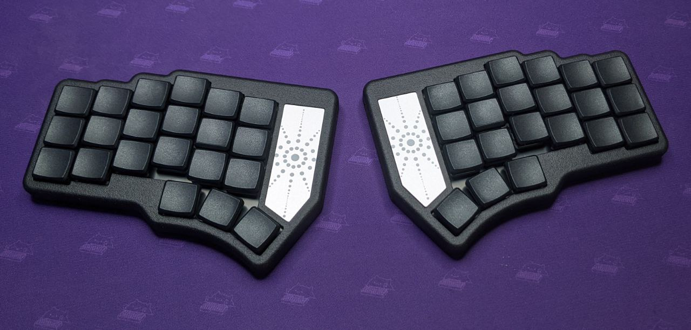

# Zireael keyboard

Zireael is an ergonomic wireless split keyboard with a design bias. Keyboard for Kailh Choc switches based on MINEW MS88SF2 BLE module.

The keyboard is based on Dao Chok BLE. The locations of components on the board have been changed, space for the battery has been added, and the thumb cluster has also been changed.

Inspiration for the keyboard was taken from these keyboards:
- [Dao chok BLE](https://github.com/yumagulovrn/dao-choc-ble) by [Rafael](https://github.com/yumagulovrn) - components pcb
- [Corne-ish Zen](https://lowprokb.ca/products/corne-ish-zen) by [DarrylDH](https://github.com/LOWPROKB) - the idea to create a beautiful case
- [Cornelius](https://geekhack.org/index.php?topic=109741.0) by [foostan](https://github.com/foostan) - keyboard view

## Features

- Hotswapabble
- ZMK firmware
- Low profile
- Top mount
- Choc Spacing (18mm x 17mm)

## Firmware

Latest compiled ZMK firmware for this keyboard can be found here: https://github.com/Mposiblee/zireael-zmk-config/releases/tag/firmware
Source Code: https://github.com/Mposiblee/zireael-zmk-config

## Build guide

https://github.com/Mposiblee/Zireael/blob/main/doc/build_guide.md

## Contacts

Telegram channel: https://t.me/mposibl

My telegram: https://t.me/mposible

